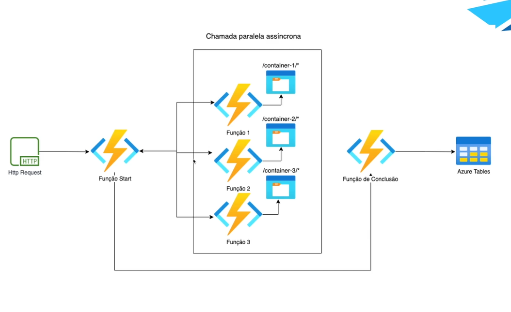

# DurableFunctionsOrchestration

## Descrição do Projeto

Este projeto tem como objetivo demonstrar o uso das Durable Functions, uma característica do Azure Functions, em um cenário de processamento de funções assíncronas. As Durable Functions permitem criar workflows orquestrados que coordenam a execução de várias funções assíncronas de maneira confiável.

## Funcionalidades

- Demonstração da criação de fluxos de trabalho orquestrados usando Durable Functions.
- Exemplo de coordenação de funções assíncronas em um cenário de processamento.

## Como Usar

1. Clone este repositório para sua máquina local.
2. Certifique-se de ter uma conta do Azure.
3. Configure as credenciais do Azure no projeto.
4. Execute o projeto e explore os exemplos de uso das Durable Functions.

## Requisitos

- Conta do Azure.
- Ferramentas de desenvolvimento do Azure (Azure Functions Core Tools, Visual Studio Code com extensões do Azure, etc.).

## Exemplos

O projeto inclui exemplos de como criar e orquestrar fluxos de trabalho usando Durable Functions. Você encontrará exemplos de definição de workflows, chamadas de funções assíncronas e gerenciamento de estados.

## Contribuição

Contribuições são bem-vindas! Sinta-se à vontade para abrir uma **Issue** para discutir novas ideias ou enviar um **Pull Request** com melhorias.

